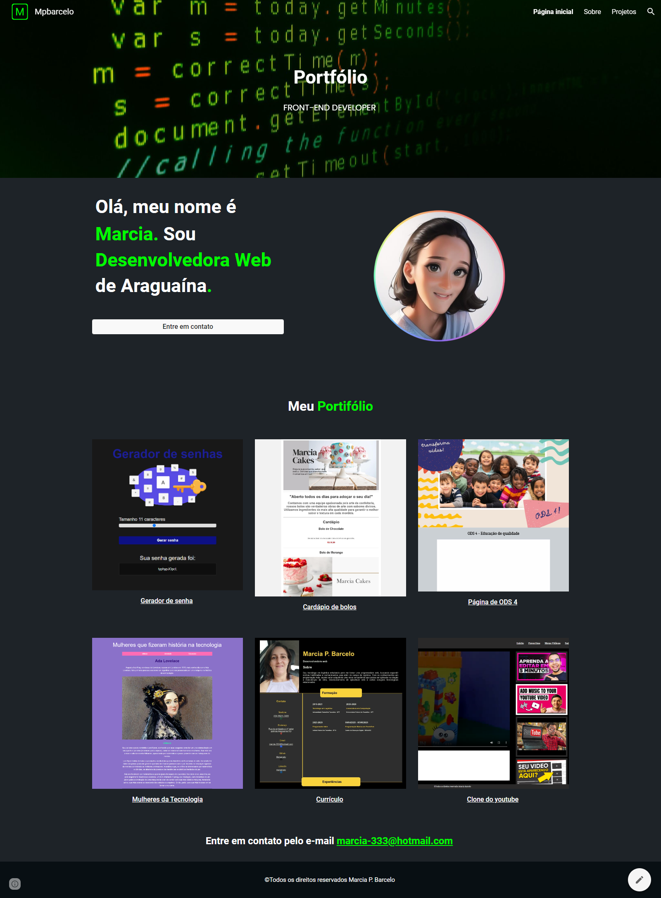
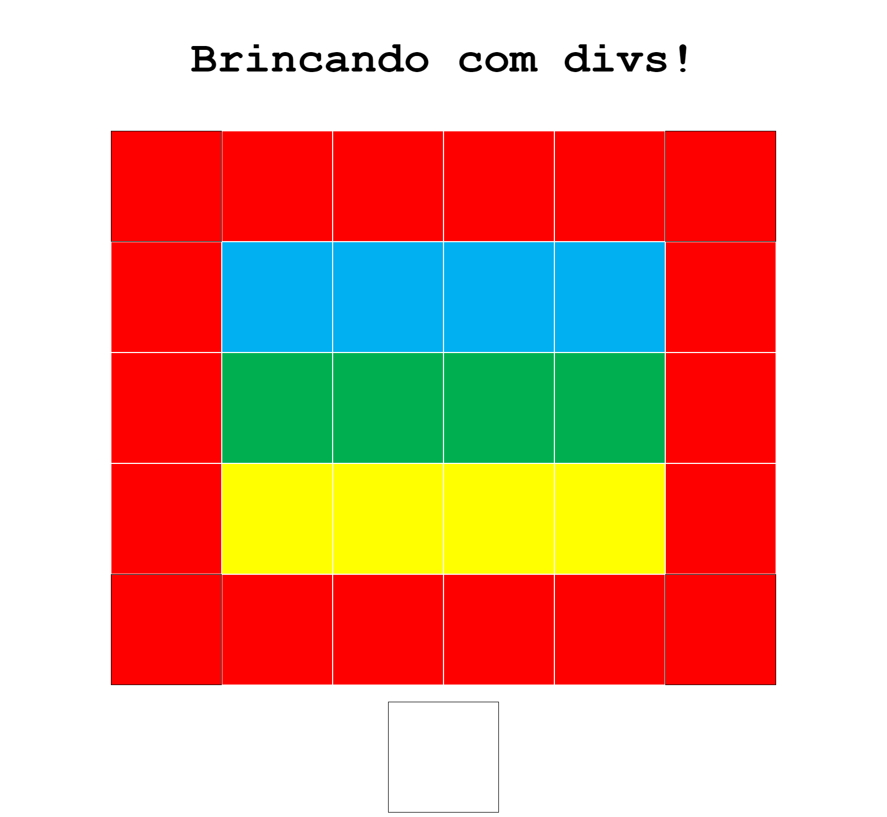
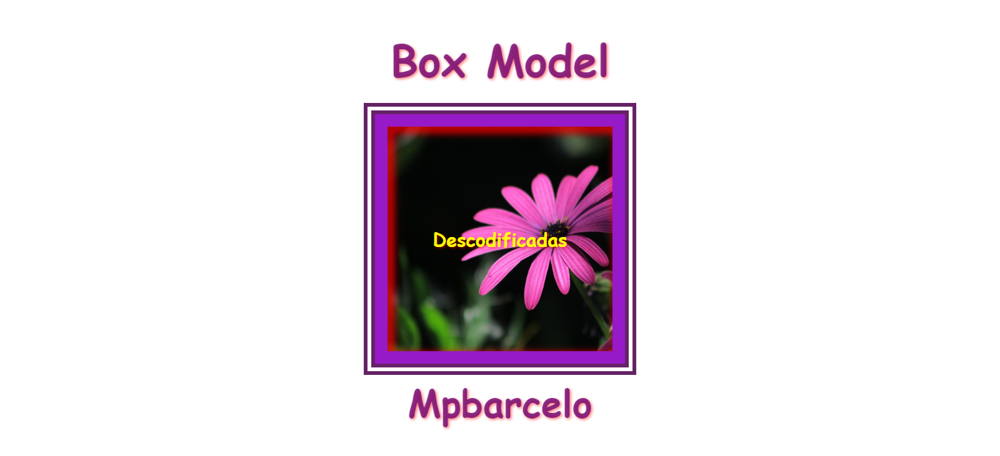
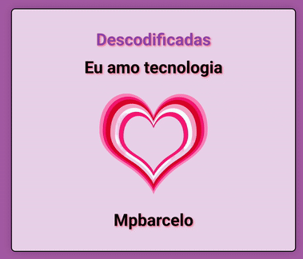

 # Portfólio Descodificadas - Trilha 01

Bem-vindo ao meu portfólio desenvolvido durante a trilha 01 do programa Descodificadas. Aqui você encontrará alguns projetos que demonstram minhas habilidades e conhecimentos adquiridos ao longo do curso.

## Projetos

### 1. [Protótipo do projeto no google sites.](https://sites.google.com/view/mpbarcelo)

Protótipo do projeto final da trilha 1 do curso descodificadas desenvolvido no google sites.

### 2. [Brincando com divs](https://mpbarcelo.github.io/atividade-com-divs/)

Durante a trilha 1 do "Descodificadas", realizei uma atividade prática explorando a manipulação de div's por meio da criação de um projeto divertido utilizando HTML e CSS.

### 3. [Box Model](https://mpbarcelo.github.io/boxmodel-descodificadas/)

Projeto Box Model desenvolvido também na tilha 1 do curso descodificadas, foram utilizados html e css.

### 4. [Animação Coração pulsante](https://mpbarcelo.github.io/animacoes-descodificadas/)

Durante a trilha 1 de "Descodificadas", desenvolvi um trabalho envolvente e criativo, o Coração Pulsando que combinou habilidades em HTML e CSS para criar uma experiência visualmente impactante. A essência do projeto foi dar vida ao coração pulsante através de técnicas de animação.

## Tecnologias Utilizadas

- Lista das principais tecnologias e linguagens que utilizei nos projetos.
 - Exemplo: HTML e CSS.

## Seção Projetos

Nesta seção, você encontrará uma cuidadosa seleção dos meus projetos, cada um deles acompanhado por uma descrição detalhada e das linguagens de programação utilizadas. Alguns desses projetos foram desenvolvidos como parte do curso Descodificadas, enquanto outros surgiram de diferentes cursos que participei. Cada imagem nesta seção é interativa e serve como um portal direto para a página específica de cada projeto, bem como para o respectivo repositório. Sinta-se à vontade para explorar e mergulhar no meu trabalho. Ao clicar nas imagens abaixo, você poderá conhecer mais sobre cada projeto, bem como minha abordagem criativa e técnica. Espero que aprecie o que encontrará!

## Sobre Mim

Sou tecnóloga em logística buscando ampliar meu horizonte profissional, atualmente dedicando-me ao estudo de desenvolvimento web para me tornar uma programadora web. Meu objetivo é expandir minhas habilidades e conhecimentos para além do campo da logística e adentrar o mundo da programação web. Acredito que ao combinar minha experiência em logística com as habilidades em programação web, poderei oferecer soluções tecnológicas inovadoras.

## Contato

- Email: marcia-333@hotmail.com
- LinkedIn: [mpbarcelo](https://www.linkedin.com/in/mpbarcelo/)
- Github: [Mpbarcelo](https://github.com/Mpbarcelo)

Sinta-se à vontade para entrar em contato para discutir colaborações, oportunidades ou apenas para trocar ideias sobre desenvolvimento!
